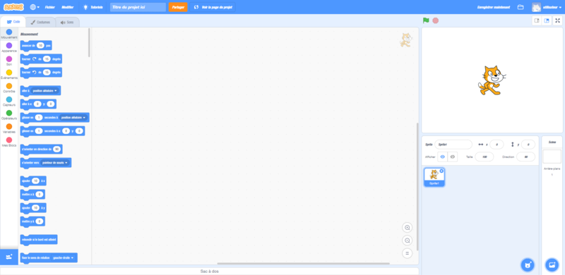

<!--
N.B.: This README was automatically generated by <https://github.com/YunoHost/apps/tree/master/tools/readme_generator>
It shall NOT be edited by hand.
-->

# Scratch for YunoHost

[](https://ci-apps.yunohost.org/ci/apps/scratch/)  

[](https://install-app.yunohost.org/?app=scratch)

*[Read this README in other languages.](./ALL_README.md)*

> *This package allows you to install Scratch quickly and simply on a YunoHost server.*  
> *If you don't have YunoHost, please consult [the guide](https://yunohost.org/install) to learn how to install it.*

## Overview

Scratch is a free programming language and online community where you can create your own interactive stories, games, and animations.

**Shipped version:** 4.0.36~ynh1

**Demo:** <https://scratch.mit.edu/projects/editor/?tutorial=getStarted>

## Screenshots



## Documentation and resources

- Official app website: <https://scratch.mit.edu/>
- Official admin documentation: <https://scratch-wiki.info/wiki/Scratch_3.0>
- Upstream app code repository: <https://github.com/scratchfoundation/scratch-gui>
- YunoHost Store: <https://apps.yunohost.org/app/scratch>
- Report a bug: <https://github.com/YunoHost-Apps/scratch_ynh/issues>

## Developer info

Please send your pull request to the [`testing` branch](https://github.com/YunoHost-Apps/scratch_ynh/tree/testing).

To try the `testing` branch, please proceed like that:

```bash
sudo yunohost app install https://github.com/YunoHost-Apps/scratch_ynh/tree/testing --debug
or
sudo yunohost app upgrade scratch -u https://github.com/YunoHost-Apps/scratch_ynh/tree/testing --debug
```

**More info regarding app packaging:** <https://yunohost.org/packaging_apps>
